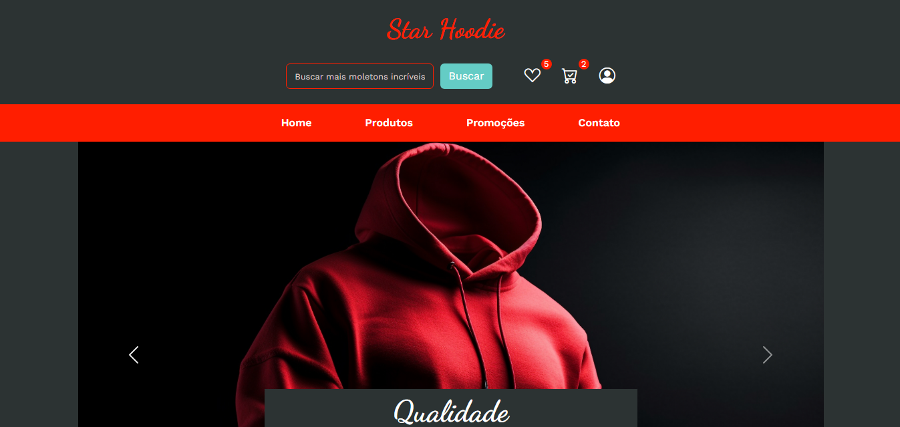
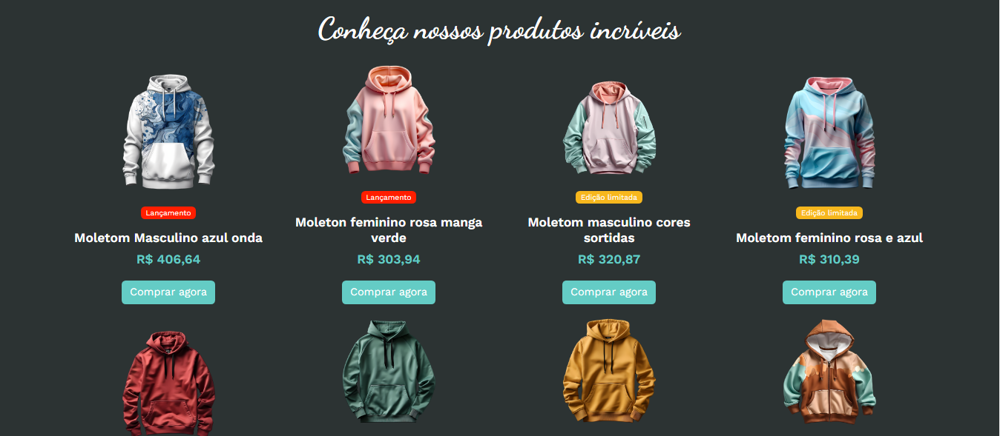
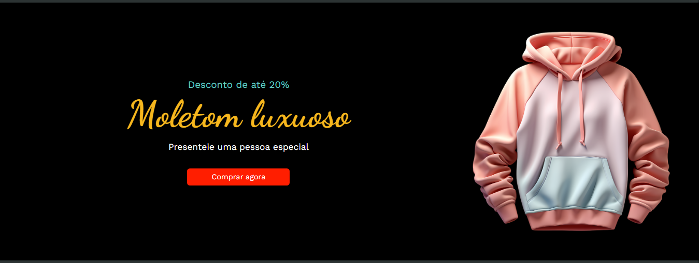
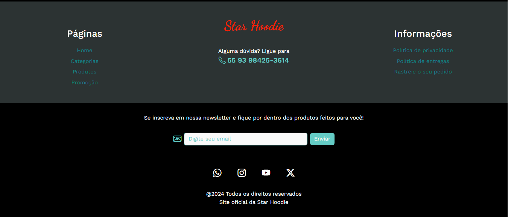

<h1>Loja Star Hoodie</h1>

Construída com Bootstrap 5

Site e loja virtual de moletons de alta qualidade e estilo, com design elegante e cores animadas fugindo do tédio e se deparando com roupas incríveis para todos os públicos

> Site disponível para mobile e desktop

<h2>Conceitos aplicados:</h2>
<ul>
    <li>Navbar</li>
    <li>Carousel</li>
    <li>Grid</li>
    <li>Flexbox</li>
    <li>Container</li>
    <li>Media queries</li>
    <li>Imagens fluidas</li>
    <li>Bootstrap Icons</li>
</ul>

<a href="https://helenaoliveira366.github.io/Loja-Star-Hoodie/" target="_blank" rel="noopener noreferrer">Você pode acessar o projeto aqui</a>

<h3>Abaixo tem algumas imagens do projeto</h3>

